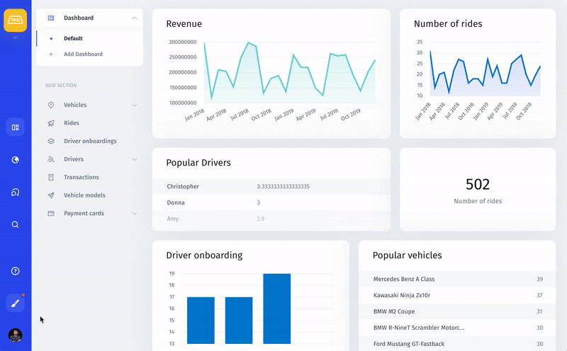

# Connecting your resources

Jet Admin integrates with most data sources, such as PostgreSQL, internal APIs, Stripe, Firebase, SQLite, etc. Check out our continuously updating list of all supported resources here. 

You can add different resources simultaneously either on the welcome page that will pop up after you sign up or later on from Settings.

### 1.1 Adding a resource

Once you've signed up, created a project, and choose 'Add a resource' you can see block with available resources:

### 1.2 Adding a resource from settings

To add a resource from Settings, go to your Profile → Settings → Resource. Connect a new resource by clicking the **+ Add Resource** button in the top right corner:

### 2. Choose a resource

Simply click on the icon of a resource you'd like to connect and follow the instructions. You can add multiple resources:

See detailed guides on how to add different resources here:



