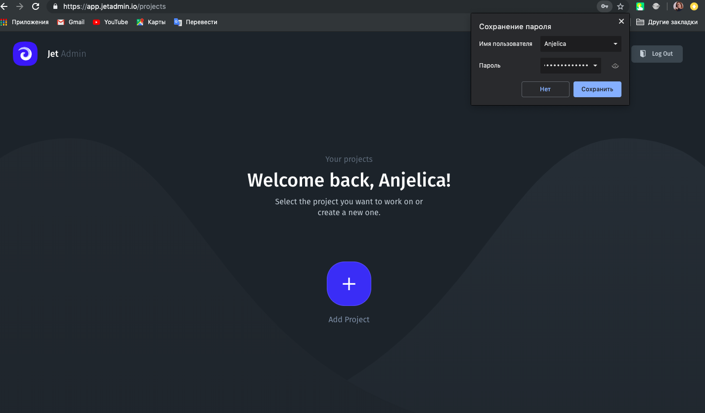
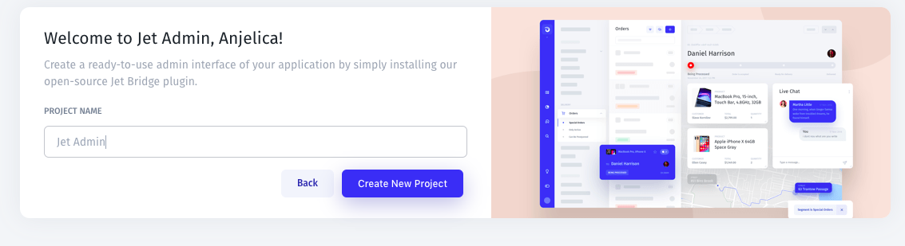

# Creating a project

1. Start by creating a new account at [https://app.jetadmin.io/register](https://app.jetadmin.io/register) or sign up with Google/Facebook.

2. Once you've signed up, you'll be able to add a new project to Jet Admin and start the installation process. 

3. Specify the name of your project and choose how you would like to install Jet Admin. 

4. Choose how would you like to create an app:

* Create an App from Scratch. Start with drag-and-drop components to build your application
* Create an App from a Template. Start with pre-built templates \(Customer Support Tool, Onboarding Tool...\)
* [Add a Resource](adding-a-data-source.md). Connect any of your databases or APIs \(PostgreSQL, Stripe, Firebase, ..\)

