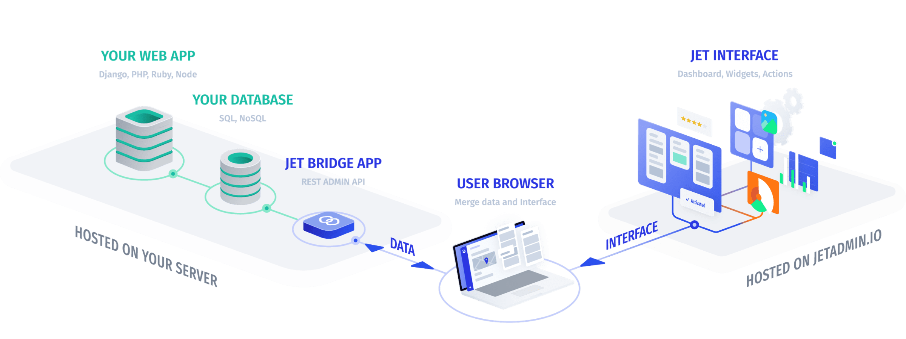
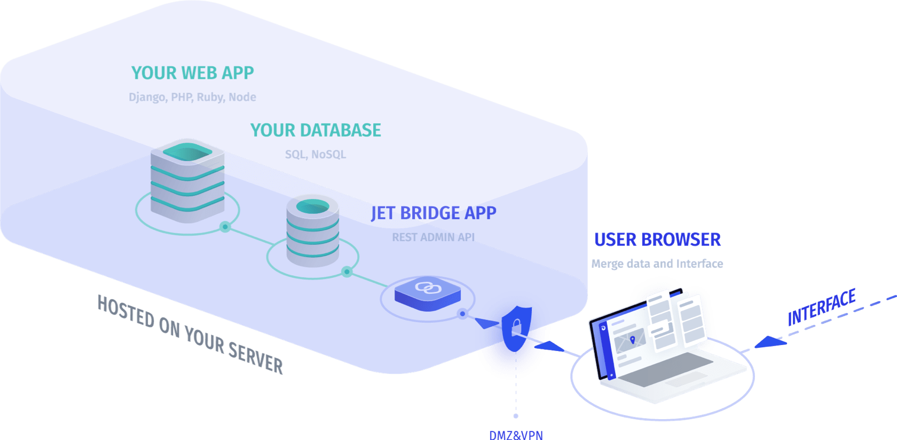

# Data privacy & Security

## We never access your private data

Jet Admin is built in a way that it **hosts** **only** **your** **admin panel interface**. We don’t collect or host your private data. Thanks to Jet Admin’s architecture, we are able to display and support your admin without actually accessing your information.

So how exactly does it work? Jet Admin is **a SaaS frontend application** that communicates with your database through Jet Bridge, a component that you install **locally and integrate to your web application or database**. Jet Bridge generates an API for your application to work with and forwards your data directly to your end browser, where the data connects with Jet’s interface. It ensures that your data **remains invisible to our servers**.

#### Enforced two-factor authentication 

Is there such a thing as too much security? Definitely not when it comes to your company’s private data. In Jet, you can additionally secure your workspace by setting up enforced two-factor authentication for each team member. Once the feature is activated, every time someone tries accessing your admin panel, they will be asked to verify the login attempt by typing in a security code sent to either their mobile phone or email.  

#### Incident Recovery 

As much as we want to ensure a 100% smooth workflow for your business team, incidents do happen. For instance, a newly hired intern may accidently delete an important KPI chart or someone can just click on the wrong button and mess up a board your entire team has been working on for months.   

To prevent bad consequences for your business, Jet Admin automatically creates a backup of your interface, so you can always restore it in case of an incident. Simply push the “Recover” button at the top right corner of your screen and select what you would like to backup.

#### DMZ 

Since Jet Admin doesn’t require access to your data, you are free to host your admin’s API under DMZ or VPN network. Once you do that, your admin panel will be separated from your public network, leaving no chance for malicious attacks or remote rooting. This might be on a checklist for some large healthcare and financial companies that can be held liable for clients’ personal information. In most cases though, it is not a necessity.  

#### IP Whitelisting 

When your company grows to an enterprise, it is especially hard to track how many people end up having access to your data. Not to be dramatic, but there is always a possibility for an insider attack. Thanks to the IP Whitelisting feature, you can create a list of the IP addresses you trust to interact with your Jet admin panel.  

