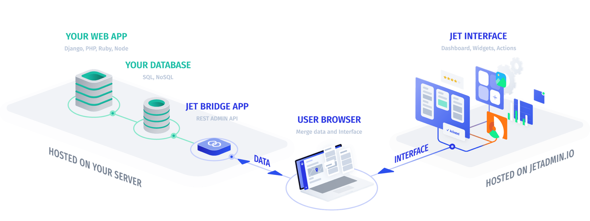

# How it works

**Jet Admin** is a SaaS frontend application hosted on **Jet Admin** side that works in your browser. It connects to your project SQL database through open source **Jet Bridge** backend application which you install on your side. So Integrating **Jet Admin** with your project requires installing only one component - **Jet Bridge**. Here how it should look like after installation:

**Your Web App**

Any of your applications which works with your **Database**. **Jet Admin** does not interact with it directly.

**Your Database**

Your database **Jet Admin** has no direct access to.

**Jet Bridge App**

An open source application installed on your server's side and connected to your database. It automatically generates REST API based on your database structure. **Jet Interface** works with **Database** through **Jet Bridge**.

**Jet Interface**

Web application accessible from any browser. Maintaining and updating of this web application is on **Jet Admin** team side. Your application data is transmitted directly from **Jet Bridge** to **Jet Interface** in your browser and remain invisible for the **Jet Admin** service.

### Data Privacy

The main advantage of Jet Admin’s architecture is that absolutely no data transits or crosses our servers. The user accesses application data directly from the client and Jet Admin is just deployed as a service to display and interact with the data. 

With Jet Admin, your data are transferred directly from your application to your browser while remaining invisible to our servers.

### User Authentication

When user logs in **Jet Admin** he receives **User Token** generated by **api.jetadmin.io**. Jet Admin **UI settings** are stored on the **api.jetadmin.io** and your **Project Data** is stored on **Your Web App** server. 

So the user browser can send the following requests:

* to get or update **UI settings** user browser sends requests to **api.jetadmin.io** and passes **HTTP Authorization Header** containing **User Token**. Because **api.jetadmin.io** is an issuer of this token - it can verify it.
* to get or update **Project Data** user browser sends requests to **Jet Bridge App** \(open source\) installed on **Your Server** and passes the same **HTTP Authorization Header** containing **User Token**. **Jet Bridge App** performs requests to [https://api.jetadmin.io/api/project\_auth/](http://api.jetadmin.io/api/project_auth/) endpoint and passes received **User Token** to verify if its valid and if user has enough permissions. Also **Jet Bridge App** sends its **Project Token** to all api.jetadmin.io endpoints which is described below.

### Jet Bridge Authentication

In order for **Jet Bridge App** be able to communicate with **api.jetadmin.io** it obtains its unique **Project Token** which will be used to authenticate all requests to **api.jetadmin.io**. This token is generated by making call to **api.jetadmin.io** once on **Jet Bridge App** install and saved in **Your Database**.

