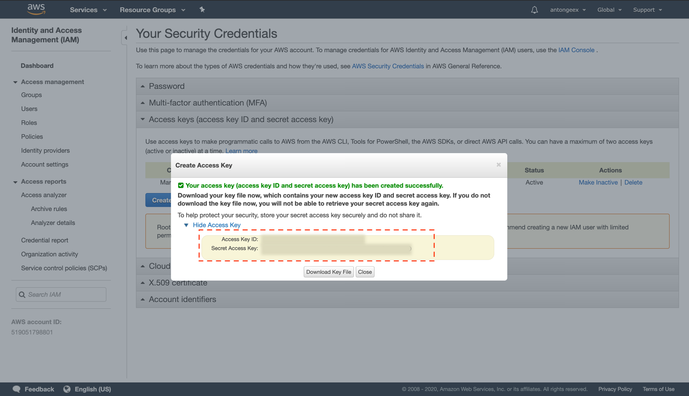

# Amazon S3

## 1. Create a Secret Access Key

Create a new _Secret Access Key_ by navigating to the "Access Key" section of your "Security Credentials" tab and pressing "Create New Access Key". After that, download your newly created _Key File._

**Dashboard &gt; My Security Credentials &gt; Access Keys &gt; Create New Access Key**

