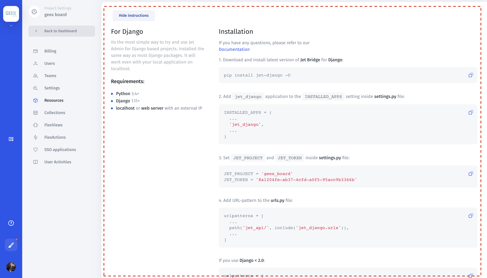

# Django

To integrate **Jet Admin** with your **Django** project you need to install the **Jet Bridge** package. It will work even with your local application on **localhost**. **Jet Bridge** is an open**-**source plugin available on [**Github**](https://github.com/jet-admin/jet-bridge)**.** It will connect to your database and link **Jet Admin** with your project. It will work even with your local application on **localhost**. [How it works.](../../jet-bridge-deployment/install/)

This is the quickest way to install **Jet Admin** for Django based projects. Installed in the same way as most **Django** packages.





**Jet Admin** for **Django** is a Python package installed with **pip** that integrates with your **models** and generates **API** interface through which **Jet Admin** can operate with your data. Though using this package is supported we recommend to use [standalone Jet Bridge](../../jet-bridge-deployment/install/#method-1-using-standalone-jet-bridge) as described before if possible.


**Jet Bridge** for **Django** sources are available on **Github:**  
[https://github.com/jet-admin/jet-django](https://github.com/jet-admin/jet-django)



#### Requirements

* **Python** 3.4+
* **Django** 1.11+
* **localhost** or **web server** with external IP

To integrate **Jet Admin** with your **Django** project you need to install the **Jet Bridge** package. It will work even with your local application on **localhost**.

**Jet Bridge** **for Django** sources are available on **Github:**  
[https://github.com/jet-admin/jet-django](https://github.com/jet-admin/jet-django)

This is the quickest way to install **Jet Admin** for Django based projects. Installed in the same way as most **Django** packages.

#### Installation

1. Follow this guide to create project:  
[https://app.jetadmin.io/projects/create](https://app.jetadmin.io/projects/create)

2. Download and install the latest version of **Jet Bridge** for **Django**:

```bash
pip install jet-django
```

3. Add `jet_django` application to the `INSTALLED_APPS` setting inside **settings.py** file:

```python
INSTALLED_APPS = (  ...  'jet_django',  ...)
```

4. Set JET\_PROJECT and JET\_TOKEN inside **settings.py** file:

```text
JET_PROJECT = 'hi_16'
JET_TOKEN = '20a05f49-52c9-4015-ab72-9332dc0c8732'
```

5. Add a URL-pattern to the **urls.py** file:

```python
urlpatterns = [  ...  path('jet_api/', include('jet_django.urls')),  ...]
```

If you use **Django &lt; 2.0:**

```python
urlpatterns = [  ...  url(r'^jet_api/', include('jet_django.urls')),  ...]
```

6. Restart your project

8. Finish installation by opening this link in your browser: [**http://localhost:8000/jet\_api/register/**](http://localhost:8000/jet_api/register/) where **localhost** is your **Django** HOST and **8000** is its PORT. 


**Jet Django** package sets **CORS** headers for **/jet\_api/** endpoints. If it conflicts with your **CORS** headers and you want to deal with it yourself, add the following in **settings.py**:   
JET\_CORS\_HEADERS = False




## Common problems



