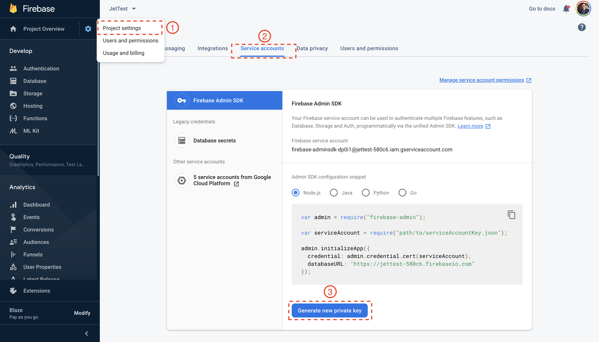

# Firebase / Firestore

Connect Jet Admin to Firebase's Admin API to create custom internal tools to manage your Firebase application.

Once Firebase is added to Jet Admin, you'll be able to manage your users, query and update Firebase Real-time Databases as well as query Firestore.

## 1. Get Firebase Key

On your Firebase dashboard, go to the _Service accounts_ section under the _Settings_ tab. Press _"Generate new private key"._ Securely store the _JSON file_ containing the _Service Account Key_.

**Firebase &gt; Project Settings &gt; Service accounts &gt; Generate a new private key**

Jet Admin will validate that it is able to connect to your Firebase database and then save. If instead you are looking to integrate Jet Admin with Firestore, you need only fill in the _Project Id_ section on this form.

## 2. Add to Jet Admin

[Create a new resource](../adding-a-data-source.md) in Jet Admin, and select "Firebase" from the list of integrations. Enter your secret key in the "Secret key" field. Click the "Save" button to connect to Firebase.

 If you are looking to integrate Jet Admin with Firestore, you will only need to fill in the _Project Id_ section on this form.

**Resources** &gt; **Add Resource** &gt; **Firebase**

