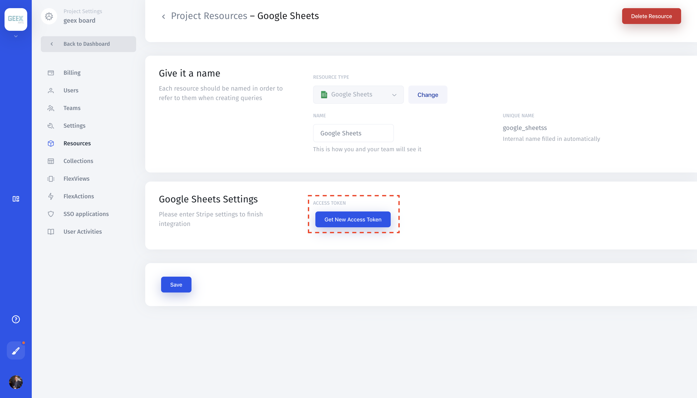
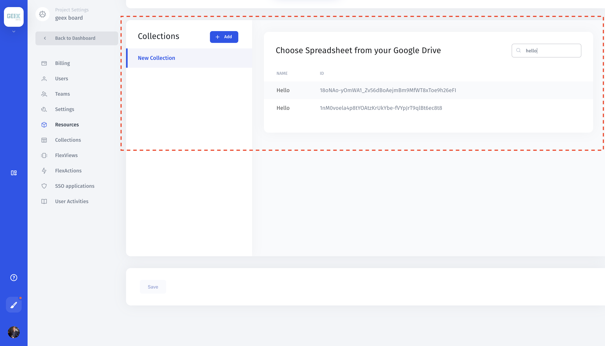

# Google Sheets

## 1. Create a Google Sheets Resource

[Create a new resource](../adding-a-data-source.md) in Jet Admin, and select "Google Sheets" from the list of integrations:

## 2. Get Google Sheets Access Token

Click the "Get New Access Token" button. You'll be automatically redirected to Google Sheets Settings to finish your integration.

## 2. Add collections

Jet pulls your spreadsheet list from the Google Spreadsheet account. Create a new collection **'+Add'**. Choose a spreadsheet from the list.

