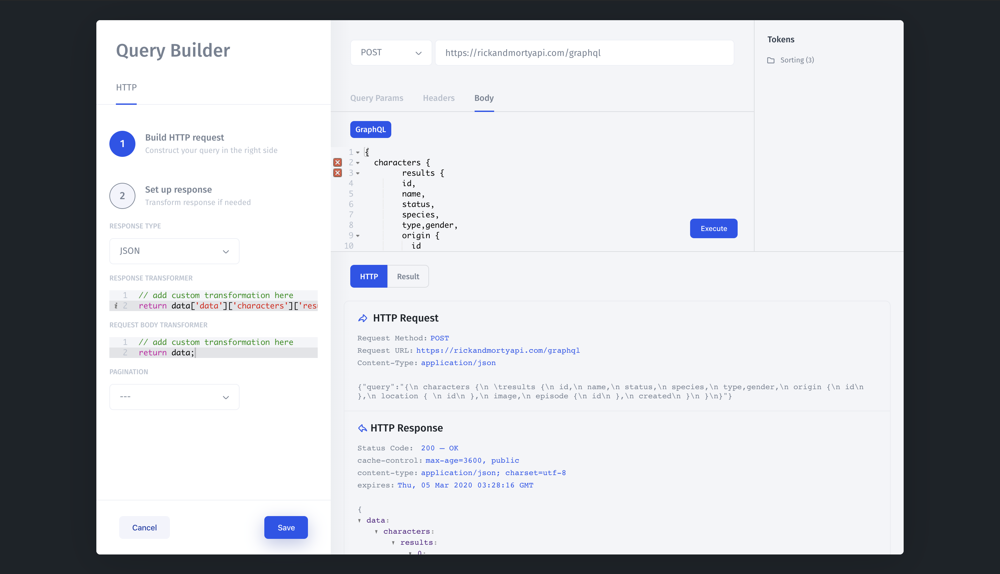

# GraphQL

### 1. Add your GraphQl resource 

To connect a GraphQL API with **Jet Admin**, add a new resource and choose "GraphQL" from the list of available integrations. Then, enter your API endpoint in the "Base URL" field. Depending on your API authentication settings, you may need to enter URL parameters or headers, or set the method via the [Authentication](https://docs.jetadmin.io/getting-started/integrations/rest-api#api-authentication) dropdown.

**Resources** &gt; **Add** &gt; **GraphQL**

### 2. Create a Query

You can now select your newly-created GraphQL resource from the _Resource_ dropdown when creating queries in your Jet Admin apps.

You can display the results of GraphQL queries as with any other query in Jet Admin.

