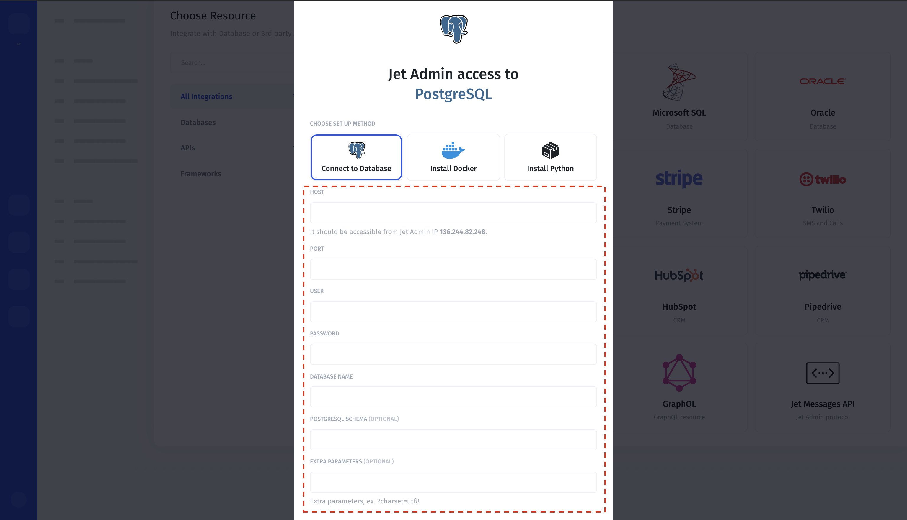

# Database Integration

### 1. Connect a database with Jet Admin

To connect a PostgreSQL database with **Jet Admin**, add a new resource and choose "PostgreSQL" from the list of available integrations. Type in your database connection details.

Setting up separate resources for read and write access is a good start to prevent anyone on the team causing unwanted changes to your database. 

**Resources** &gt; **Add** &gt; **PostgreSQL &gt; Connect to Database**

### 2. Deployment Methods

If you'd like, you can connect your database via Docker or a Python app. Simply select your preferred deployment method and follow the instructions. 

