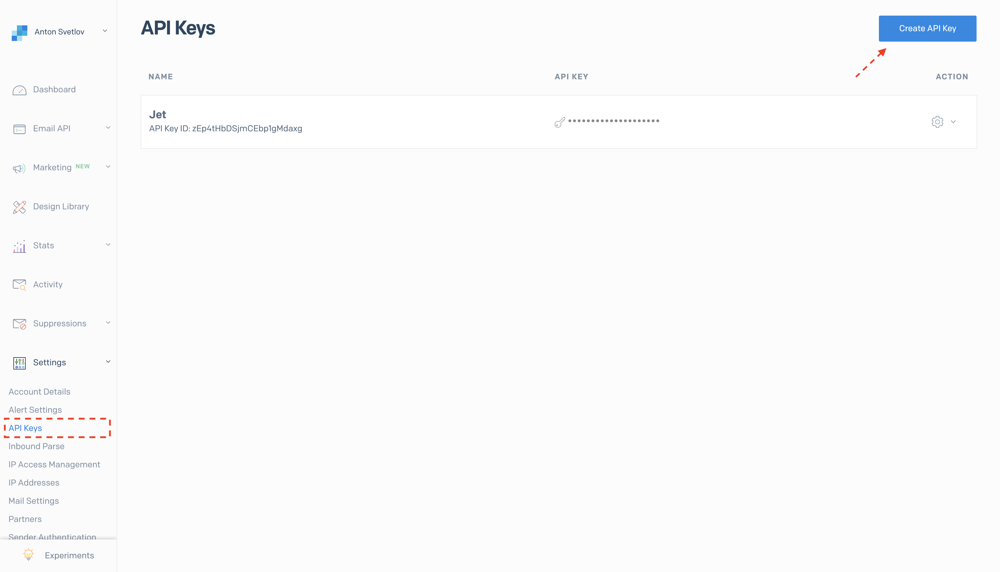
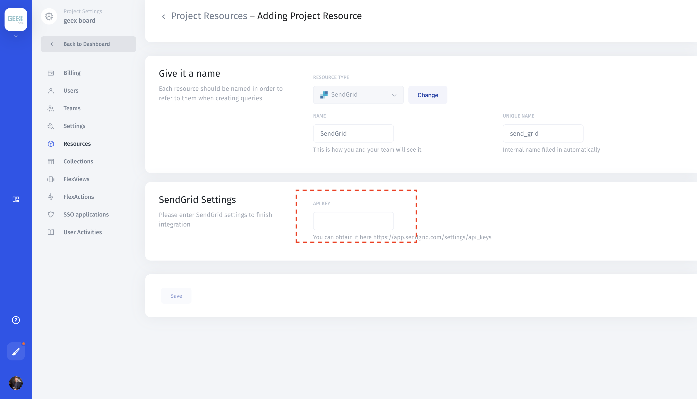

# SendGrid

## 1. Get Secret Key

You can see a list of your SendGrid API keys via the "API Keys" section of your SendGrid account's "Settings" page. If you'd like to use an existing API key, you'll have to get this from whoever set up the key — SendGrid doesn't let you display API keys after they're created. If you want to create a new API key to use with Jet Admin, you can press the "Create API Key" button to create a new key and view it. Store it somewhere safe because SendGrid won't show it to you again!

**SendGrid** &gt; **Settings** &gt; **API Keys**

### 2. Add to Jet Admin

Create a new resource in Jet Admin, and select "SendGrid" from the list of integrations. Enter your API key in the "API Key" field. Press "Save" to connect to SendGrid. 

**Resources** &gt; **Add Resource** &gt; **SendGrid**

\*\*\*\*

