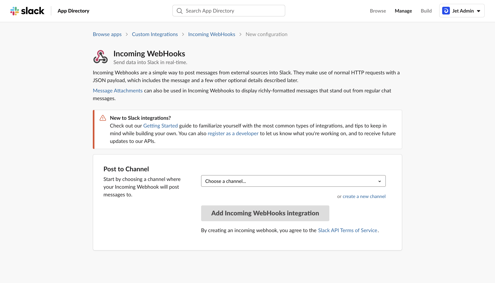
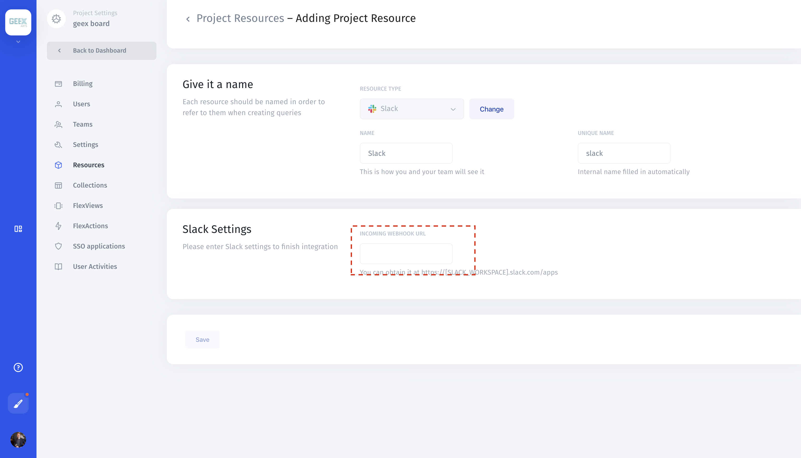

# Slack

### 1. Create Slack Webhook

To add Slack to Jet Admin, start by setting up an "Incoming Webhook" in Slack: [https://my.slack.com/apps/new/A0F7XDUAZ-incoming-webhooks](https://my.slack.com/apps/new/A0F7XDUAZ-incoming-webhooks).

Once you select a channel and create the webhook, you'll be presented with a setup screen containing details about your webhook and how to use it. Make a note of the "Webhook URL", which will be in the following format:

[https://hooks.slack.com/services/xxx/xxx/xxx](https://hooks.slack.com/services/xxx/xxx/xxx)

**Slack** &gt; **Custom Integrations** &gt; **Incoming Webhooks** &gt; **New Configuration**

### 2. Add to Jet Admin

Enter your Webhook URL in the respective field. Click 'Save' to add Slack to Jet Admin.

