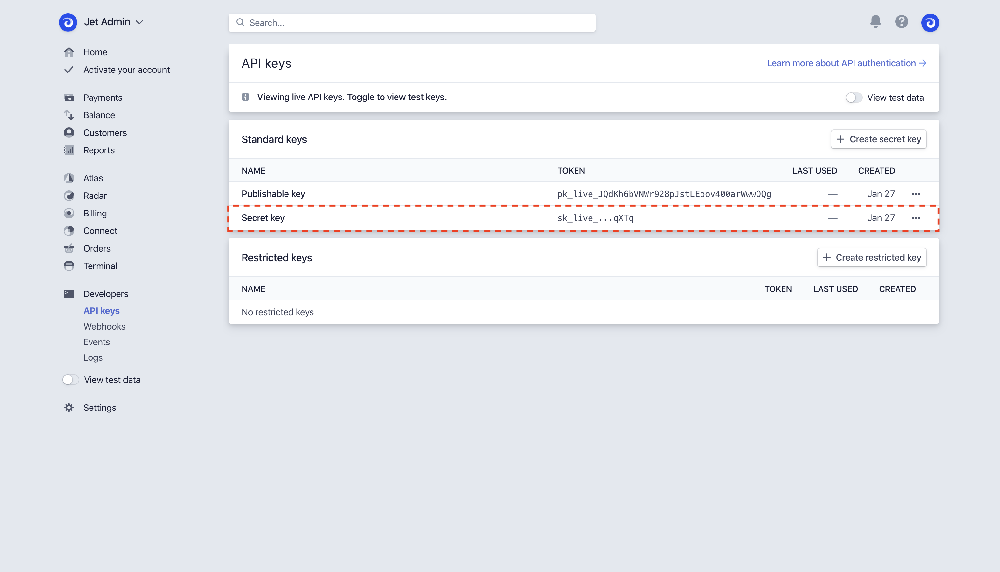
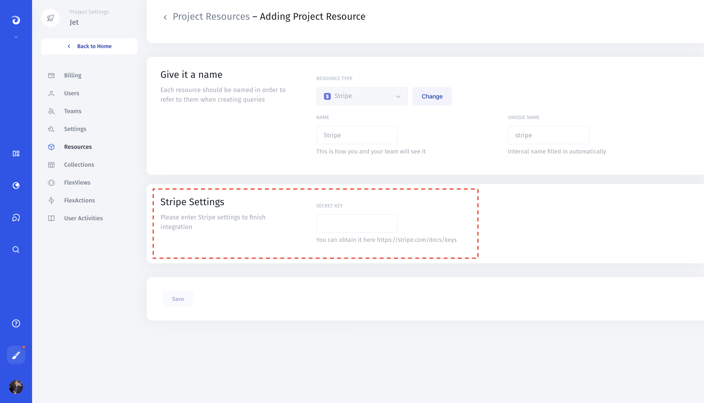

# Stripe

## 1. Get Your Secret API Key

Find your _Secret Key_ by navigating to the Developers section of your Stripe dashboard and clicking on API Keys. 

**Dashboard &gt; Developers &gt; API Keys &gt; Secret key**

## 2. Add to Jet Admin

[Create a new resource](../adding-a-data-source.md) in Jet Admin, and select "Stripe" from the list of integrations. Enter your secret key in the "Secret key" field. Click the "Save" button to connect to Stripe.

**Resources** &gt; **Add Resource** &gt; **Stripe**

## 3. Set up collections and actions

Once you've added Stripe to Jet Admin, you'll be able to see your 'Collections' or the groupings of data we pulled from your resource, such as Invoices, Subscriptions, Cards, Transactions, Refunds, etc.

Select collections that you would like to use in Jet Admin:

To quickly set up actions \(buttons that will trigger actions through an API call\) to be performed on your payments data, specify collections  and grant permissions for each individual action:

## 4. Predefined interface

We prepared customizable templates of how you can visualize your data in Jet Admin. You can either employ the templates as they are or use them as a starting idea for your unique tools.

