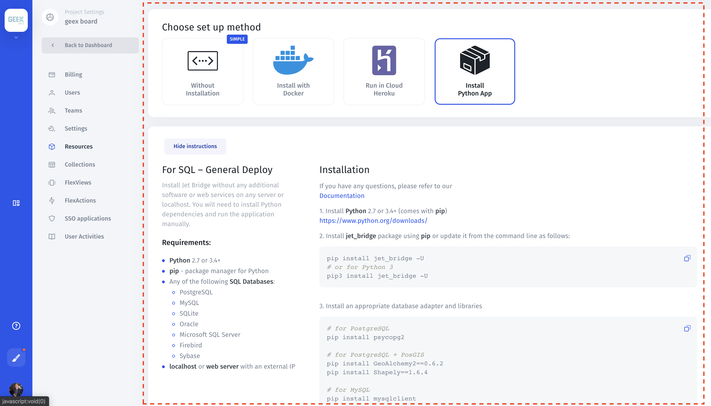

# Any SQL – Jet Bridge App

Install **Jet Bridge** without any additional software or web services on any server or localhost. You will need to install **Python dependencies** and run the application manually.





#### Requirements

* **Python** 2.7 or 3.4+
* **PIP,** a package manager for Python packages
* Any of the following **SQL Databases**:
  * PostgreSQL 
  * MySQL 
  * SQLite 
  * Oracle 
  * Microsoft SQL Server 
* A **localhost** or **web server** with an external IP address.

#### Installation

1. Follow this guide to create a project: [https://app.jetadmin.io/projects/create](https://app.jetadmin.io/projects/create)
2. Install **Python** 2.7 or 3.4+ \(comes with **pip\)** [https://www.python.org/downloads/](https://www.python.org/downloads/)
3. Install **jet\_bridge** package using **pip** or update it from the command line as follows:

```bash
pip install jet_bridge -U# or for Python 3pip3 install jet_bridge -U
```


For **Windows** you need to specify **pip** full path and run command this way \(**pip** is stored in **Scripts** folder inside **Python**, path may be different in your case\):  
_C:\Users\User\AppData\Local\Programs\Python\Python37-32\Scripts\pip.exe install jet\_bridge -U_


4. Install an appropriate database adapter and libraries

```bash
# for PostgreSQLpip install psycopg2# for PostgreSQL + PosGISpip install GeoAlchemy2==0.6.2pip install Shapely==1.6.4# for MySQLpip install mysqlclient# for MSSQLpip install pyodbc
```


For **Windows** and **MySQL** you may also need to install **Microsoft Visual C++ Redistributable for Visual Studio 2017:**  
[https://support.microsoft.com/ru-ru/help/2977003/the-latest-supported-visual-c-downloads](https://support.microsoft.com/ru-ru/help/2977003/the-latest-supported-visual-c-downloads)


5. Run **Jet Bridge** from the command line as shown below:

```bash
PROJECT=hi_16 TOKEN=20a05f49-52c9-4015-ab72-9332dc0c8732 jet_bridge
```

Note: This command will create a config file, when you run it for the first time.  
If you already have a config file, you should edit it and set options:

```text
JET_PROJECT = 'hi_16'
JET_TOKEN = '20a05f49-52c9-4015-ab72-9332dc0c8732'
```

6. After filling all required options, a config file will be generated. Now you can run Jet Bridge by executing this command once again:

```text
jet_bridge
```

7. Finish your project installation by opening in your browser \(normally it should open automatically\): [**http://localhost:8888/api/register/**](http://localhost:8888/api/register/) where **localhost** is your **Jet Bridge** HOST and **8888** is its PORT. If you want to run Jet Bridge on different host/port you can configure it \(read more at [Configuration](https://docs.jetadmin.io/getting-started/configuration) page\).


If you don't have **Jet** account yet, you will be asked to create one and sign in with the existing account.



After registering your project, you will be redirected to your project and can start working with **Jet Admin.**




## Common problems



