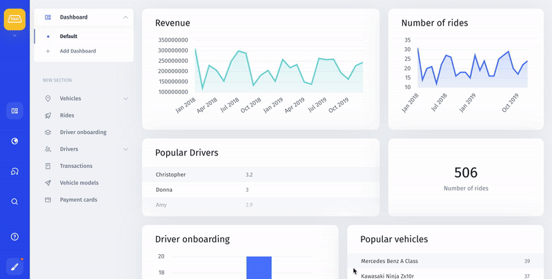
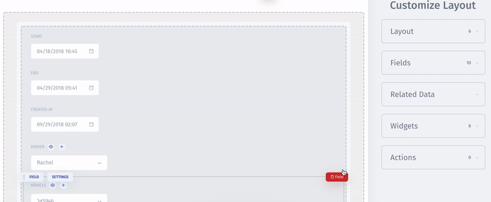

# Release Notes

## **February 16, 2020**

### **Pin actions to top**

Before, all of the actions available for a given collection or record were hidden in the main Actions dropdown. Now you can pin most repetitive actions to the top of the page, so they are always visible and easy to find when needed.  
****

### **Search collection fields in the Visual Builder**

The number of various fields available for a given collection may be overwhelming at times and extremely hard to navigate through. This is why we placed a Search bar in the Visual Builder to help you quickly find the fields you are looking for. 

### **Copy widgets**

It is now possible to copy and paste widgets on your dashboard. It might be helpful when using a completed chart as a starting point for a new type of chart based on the same dataset. For instance, you could visualize your User data as both Pie and Bar charts.  
****

To copy a widget, simply click the brush icon on the left to enter the Visual Builder mode, click the … icon next to the chart you want to copy and click ‘Copy Widget’. Your chart widget will be copied and instantly pasted on the current dashboard.  
  
****

### **Choose different colors for individual bars in a chart**

With a new update, it is now possible to choose different colors for individual bars or slices when displaying a single dataset in a chart. In the previous version, you could only choose one color for the entire chart.   
****

## **January 12, 2020**

### **Current time as default value for DATE and TIME fields**

We have set default value to the current time for date and time fields. Thus, when creating a new record of a ticket, user, or item, you don’t have to worry about typing in the current values – they will be filled in automatically.   
****

This feature is especially helpful for call agents, customer support managers, and all other employees who are bound to strict rules to follow a script and work in tight deadlines.  
****

### \*\*\*\*

### **Updated customization flow**

From now on you can switch between editing pages and areas in the Visual builder without having to re-enter the customization mode. To change the editing area, simply hover over the = icon on the left to show the menu and choose the page you want to customize.   
****

### **Dynamic select options \(generated by external API\)**

In this update, it’s become possible to display dropdown select options dynamically based on the user’s choice in a previous dropdown menu.   
****

### **Project Tokens**

Project tokens are a crucial part of the installation process. Before, you could only see your project tokens during installation. Now you can easily find them by scrolling down the Settings page. 

### **Sign in with Google**

You can now sign up and sign in to Jet Admin with your Google account. Simply authorize with your Google account password and you’re all set to start creating internal tools for your projects. No confirmation codes or filling in the registration form needed.

### 

## November 6, 2019 – Multiple dashboards, the user activities log, and related record fields!

### Multiple Dashboards

You can now create several dashboards in your admin panel. For instance, your team can have separate dashboards for Sales, Marketing, Management, etc. 

What's more, all charts can be transferred from one dashboard to another in two clicks!

### Related Record Fields

Records in some collections can be linked to each other. For instance, if you're managing a mobility company, your Drivers records will most certainly be linked to Rides records.

It would be especially helpful to be able to add fields from one related record to another, so that you don't have to switch between those records and have all necessary information at-a-glance. With the new update, you can easily do that in the Visual Builder mode!

### Editing a Record in a Table View

We enabled record editing in a table view. To edit a record in your table, simply hover over a given column and click on the appeared pen icon.

### User Activities

We added an activity log to help you keep track of all changes made to any item in your admin panel. Go to Project Settings ⟶ User Activities and search for a specific modification.

### Improvements

As part of our ongoing effort to improve your experience with Jet Admin, we have updated installation for Docker, Heroku, Jet Bridge App, and Django. 

The installation time has been reduced and all previous issues have been fixed. 

