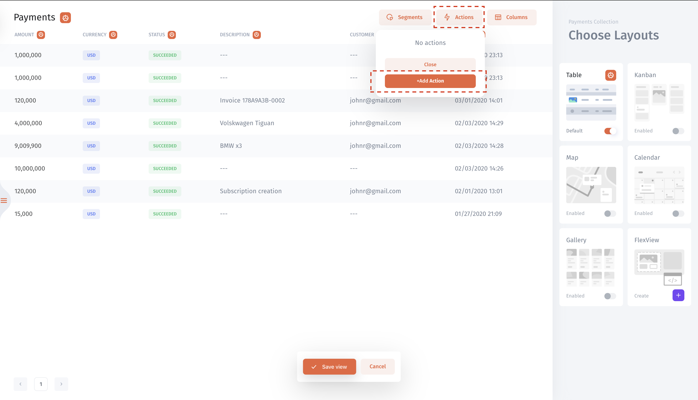

# Actions

## What is an Action?

An action is a button inside the Jet Admin interface that perform API request or write data to your database. When you connect Jet with resource you are able to see resource's actions out-of-the-box \(database: update record from table, SendGrid: send email, Twilio: send SMS, call...  \) or [write your API](writing-via-api.md) request. No single line of code is needed to enable them.

### Creating an Action

