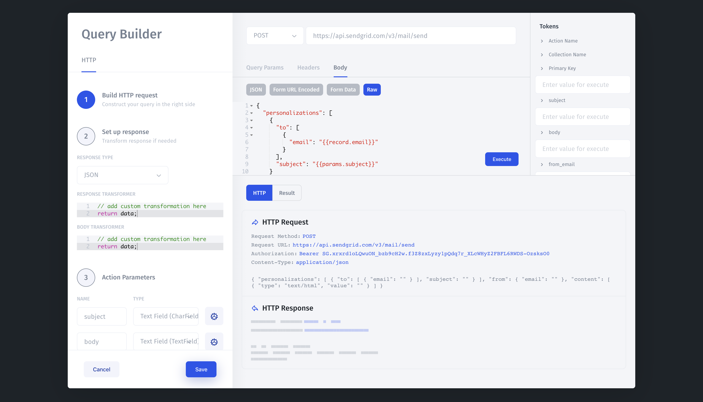

# Writing via API

## 1. Create an Action

**Customize Interface &gt; Actions &gt; +Add Action**

Choose a Resource or[ create a new](../../getting-started/integrations/) and specify action details: Name, Type. 

Define request by specifying query parameters: method \(GET, POST, ...\), URL,..

