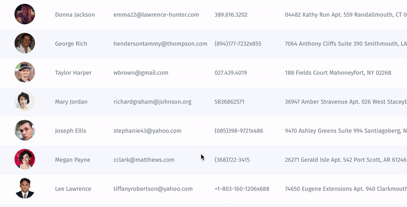

# Collection Widgets

## **What are Collection Widgets?**

Collection Widgets are simply different layout types for displaying your collection data in the most appropriate way.  

To change or add a collection widget for your collection, enter the customization mode and choose a layout type from the menu bar on the right. 

Here are the five collection widgets you can find in Jet Admin:

## Table 

When you deploy Jet Admin, all data from your database will be rendered in a Table view by default. You can later switch to a different collection widget in the customization mode or leave it just like that. 

What's more, you can edit any column in your table in a collection view by simply hovering on it and clicking the pen icon instead of entering the Visual Builder mode.

## Kanban

A kanban board is often used to simplify and visualize complex processes, e.g. user onboarding or shipping.

### 

## Map 

The map widget allows you to see locations of your items or team members \(e.g. couriers\). For instance, you can track your delivery team and vehicles' location.

To change a field that is set up as your "location field", enter the customization mode and click on the cog icon next to "Map" in the menu bar on the right.

## Calendar 

The calendar widget is great for sorting your data by date, e.g. managing appointments and meetings.

To change a field that is set up as your "date field", enter the customization mode and click on the cog icon next to "Calendar" in the menu bar on the right.

##  Gallery

A gallery is great for displaying your items in a visually appealing and easy to comprehend way. 

## Create custom widget

In case you haven't found an appropriate widget for rendering your data from our pre-existed ones, we created the Flex View feature that allows you to create and integrate your own widget into Jet.



