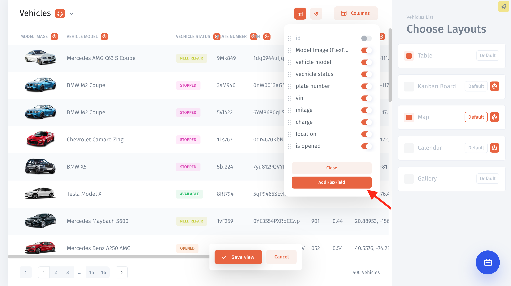
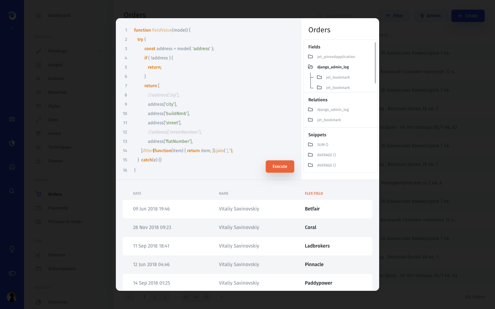

# Flex Field

### What is a Flex Field? <a id="what-is-a-smart-field"></a>

A computed value that displays contents from two different fields combined into one. For instance, it can be as simple as merging two fields _first name_ and _last name_ together.

### Create a Flex Field

Choose a Collection where would you like to create a new Flex Field. 

From there, go to the [Visual Builder](https://app.gitbook.com/@jetadmin/s/doc/~/edit/drafts/-Lk4M0St76lt7wROBK7J/v/master/visual-builder) mode → Click the 'Columns' button  → Click the 'Add Flex Field' button





You can define your custom **JavaScript** function to format fields data any way you want. With the help of model object, you can access a **Record** and its related **Records'** fields.

Here are some basic examples:

#### Return a Record field

```javascript
  
function fieldValue(model) {
    return model('unique_name');
}

```

#### Combine record fields

```javascript
  
function fieldValue(model) {
    return model('first_name') + ' ' + model('last_name');
}
```

#### Get a number of related collection records

```javascript
  
function fieldValue(model) {
    return model('photos').length
}

```

#### Parse JSON field

```javascript

function formatDate(date) {
    return date.toLocaleString('en');
}
  
function fieldValue(model) {
    const data = model('json_field');

    if (!data['timestamp']) {
        return;
    }
        
    const date = new Date(data['timestamp'])
    const formated = formatDate(from);
    const parts = formated.split(', ');
    return parts[0] + ' ' + parts[1];
}

```

