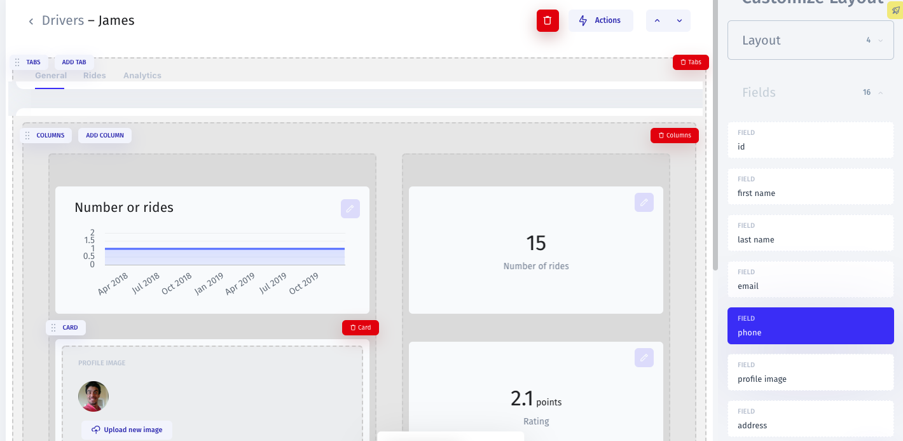
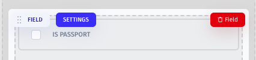
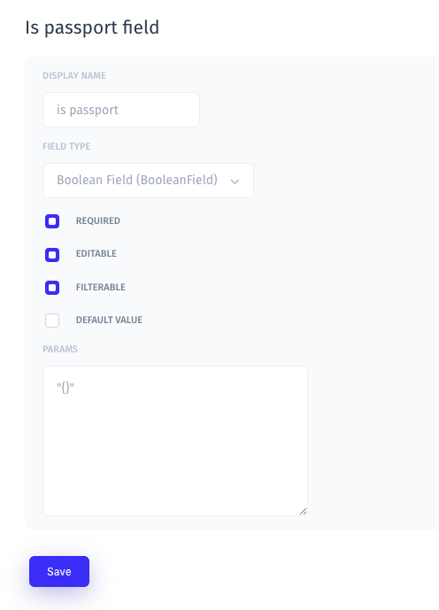
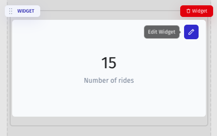

# Customize Fields

To start customizing your fields, you should enter the Visual Builder mode by clicking on the "Customize Interface" button from the Record or Collection View. 

## Edit from the Collection View

To start editing a specific field, click on the cog icon next to its name. 

In the opened window, you can type in the name of the field, choose default value, and link a related collection. You can also choose a **field widget:** text, checkbox, currency, etc.

Learn more about Field Widgets here:



## Edit from the Record View

Once you entered customization mode from the record view, you'll see all available fields for this specific record in the menu bar on the right. You can drag and drop the ones you would like to display on the record. 

Click on the "Settings" button to start editing the field's name, parameters, and choose a field widget. 

Learn more about Field widgets here:



