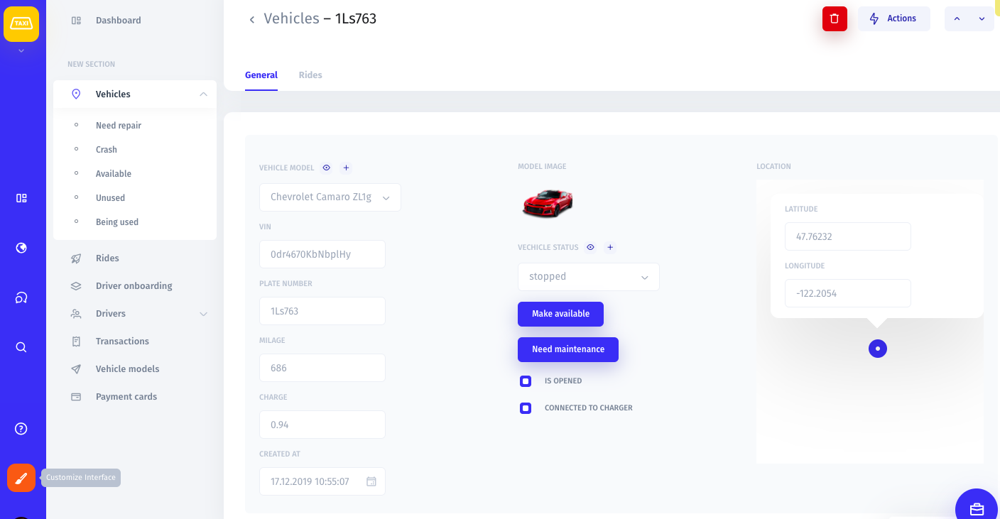

# Field Widgets

### What are Field Widgets?

Field widgets are in other words different layout styles for your fields. By default, all fields from your database will be rendered in a text widget, but you can switch to a more appropriate one by entering the Visual Builder mode.

### Setting up a field widget

There are two ways of changing a widget of a specific field: 

1. Entering customization mode from the Collection view **\(1\)** and clicking the cog icon next to the field you would like to edit **\(2\)**. ****

2. Entering customization mode from the Record view **\(3\)** and clicking on the "Settings" button next to the field you would like to edit **\(4\).**

Once you do that, you'll be able to select a widget from the list. 

There are eleven field widgets in Jet Admin:

### Single line text

Insert a single line of text. This widget is great for fields that contain names, last names, cities, order types, vehicle models, etc.

### Long text 

A long text widget is good for keeping notes and addresses.

### Number

A numer widget will let you keep prices on your items, total costs, etc.

You can customize this widget by specifying the format: will the numbers be displayed as integers or decimals, whether or not to allow negative numbers, whether or not to have a default number for this field.

Also, you can make the field read-only. 

### Checkboxes 

Checkboxes are great for following the onboarding process and the order processing cycle. 

### Single select

A single select widget lets you select one option from a predefined list of options in a dropdown menu. 

### Multiple select 

A multiple select widget lets you select one or several options from a list of predefined options in a dropdown menu. 

### Date 

You can customize a date widget by specifying the format \(e.g. MM/DD/YY, DD/MM/YY, etc.\), whether it should include a time field and, if yes, selecting the time format \(12h or 24h\).

### Email 

An email widget is great for keeping and quickly accessing the emails of your customers and partners. 

### URL 

A URL widget will let you attach a clickable link to your field. 

### Currency

A currency field widget lets you specify the currency format, precision, and whether or not to allow negative numbers.

### Rating 

A rating widget is good for visualizing your customer satisfaction score.

You can customize this widget by specifying the style \(e.g. stars, dots, etc\) and the maximum value.

### Percent 

A percent widget is great for displaying percentage data, such as what fraction of the total sales is equal to a specific single sale.

### Duration

A duration widget is great for displaying the duration of sessions, order processing, videos, calls, etc. 

You can customize this widget by specifying the duration format.

