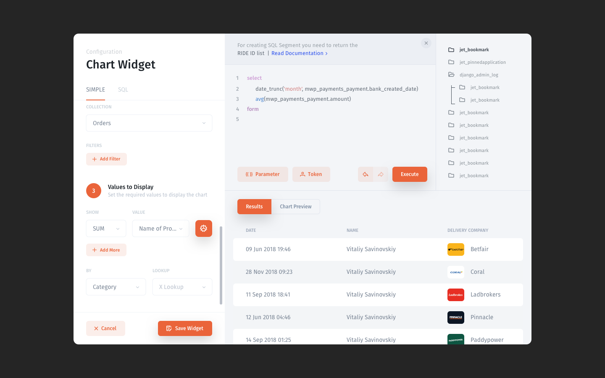

# Filters

## What is a filter?

A filter is a tool for sorting out unwanted records from a collection and quickly displaying the records you want to find. 

## Adding a filter

There are two ways to add a filter to your collection in a collection view:

**\(1\)** – Add a filter to a particular column \(i.e. collection field\) displayed in your collection by hovering over a field's name and clicking on the appeared "add filter" icon. 

**\(2\)** – Add a filter to any collection field \(even if it's not displayed as a column in your collection\) by clicking the "Filter" button in the top bar. 


Once you do that, you'll be able to specify the filter type, the comparison value. 

**\(1\)** _-_ Choose a field you'd like to use to filter your records. For instance, if you want to filter records by the values in the price field, you would choose _Price_ from the dropdown list. – _only for **\(2\)**_

**\(2\)** _**-**_ Select a filter type: contains/starts with/etc.                                                                        _Filter types may vary depending on a field's type._ 

**\(3\)** - Enter the comparison value. 

**\(4\)** - Click "**Filter**" or "**Exclude**" depending on how you want the filter to apply.                                                                                                             _The "**Filter**" option will leave only those records that match your search criteria                                                                                             The "**Exclude**" option will hide records that match your criteria_


When you apply a filter, you'll see its tag appear in the top bar of the screen **\(1\)**. If you want to be able to access the filtered data quickly, you can create a segment by clicking the disk icon **\(2\)**. 


Read more about segments here:



## Creating a SQL Query filter

To create a SQL Query filter, you would have to click the "Filter" button in the top right corner of a collection view or hover over a collection column and hit "Add filter, then click "Use SQL". 

Once it's done, you'll be taken a new window where you can specify the name of this filter, make it visible/invisible, and run a SQL query to apply this filter.



A SQL query must return a list with requested ID numbers from a selected collection 





For instance, here we run a query to return a list with ID numbers of all available vehicles at the moment.

```sql
select 
    vehicle.id
from 
    ride
left join
    vehicle
on 
    ride.vehicle_id=vehicle.id
where 
    is_opened=True
group by 
    vehicle.id
```

## Removing a filter

To delete a filter, hover over its tag in the top bar and click on the appeared **X** sign. 


