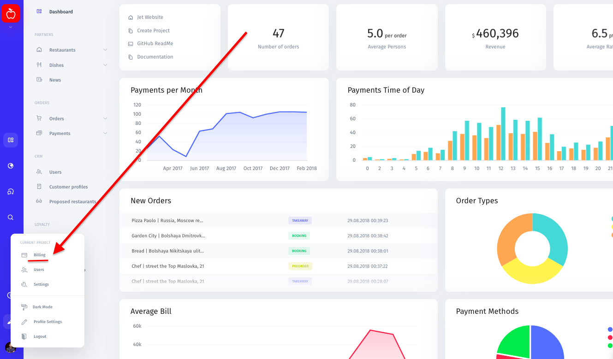
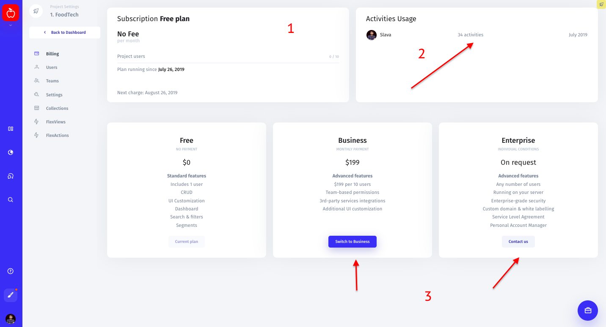

# Billing tab

The billing page will be available to you, only if you're the **owner** of an admin panel. To upgrade or make changes to your current plan, click on your profile pic in the lower-left corner of your admin panel and choose "Billing". 

You can also access the billing page directly from your admin panel's settings.

In the billing page, you can view the details about your current plan, look up the billing date and the number of users in the Subscription section **\(1\)**. In the top right corner of the page you'll see information on your activity usage: the number of modifications you and your team have made this month **\(2\)**. 

To upgrade to a PRO plan or higher, choose a plan in the lower section of the page and click either "Switch to PRO" for PRO or "Contact us" **\(3\)** for Enterprise. If you selected the latter option, you'll be taken to the Contact Sales form. Fill out this form, click "Send", and we'll get in touch with you shortly thereafter. 

