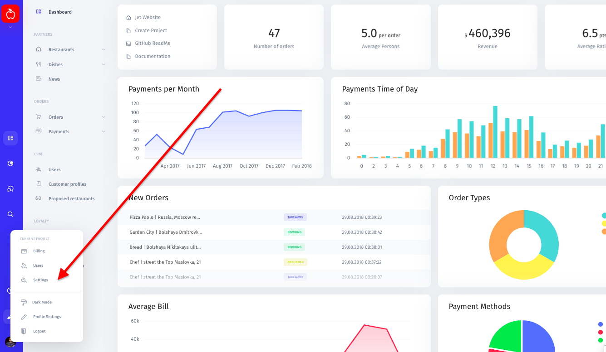
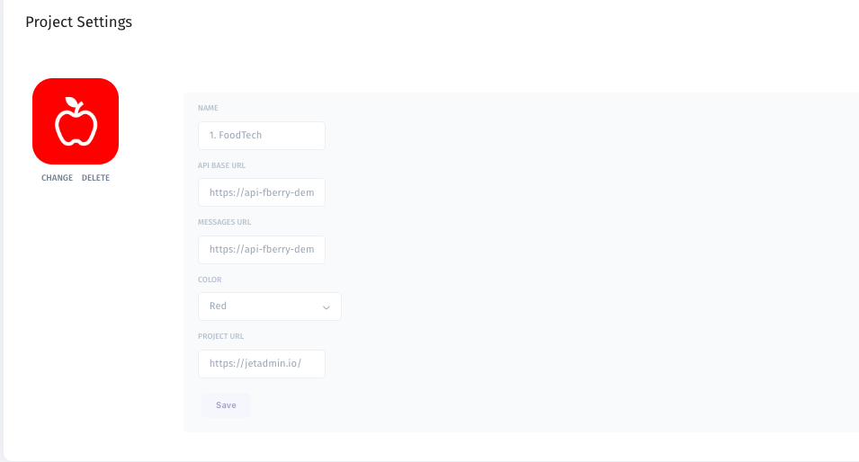
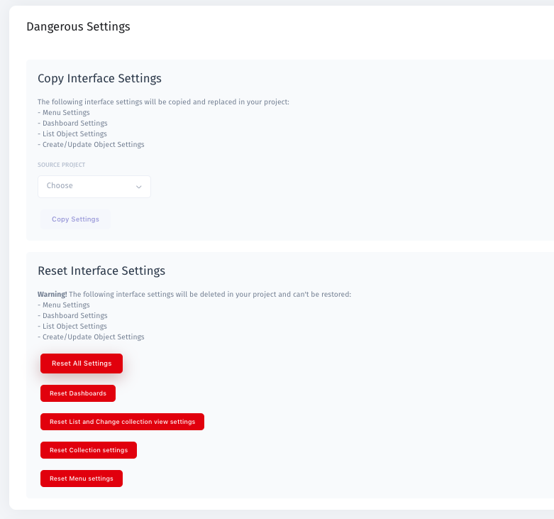
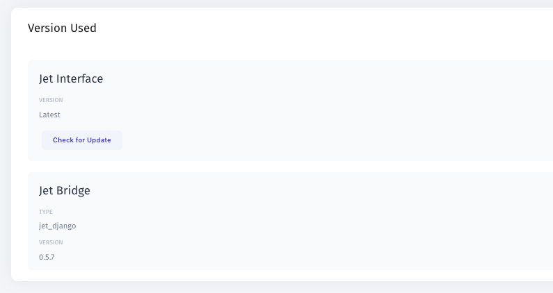

# General

To start managing the settings of your admin panel, click on your profile pic in the lower-left corner of the screen and select "Settings". 

## Project settings

In the Project Setting page you can change the name of your project, API base URL, messages  URL, project URL as well as personalize the admin panel's visual appeal by uploading your company's logo and choosing a brand color.

## Copy and reset settings

To copy settings from a different project, go to the "Dangerous" section of the Settings page and scroll down to "Copy Interface Settings". All you have to do is choose a source project from a dropdown menu.

To reset settings to default, scroll down to "Reset Interface Settings" and choose what type of settings you'd like to reset.

**Please note that once you make changes or reset your settings to default, you won't be able to call it off.**

## Check for updates

To view your current version of Jet Admin and check for updates, scroll down to the very end of the Settings page. Click "Check for Updates" to update to a higher version.

