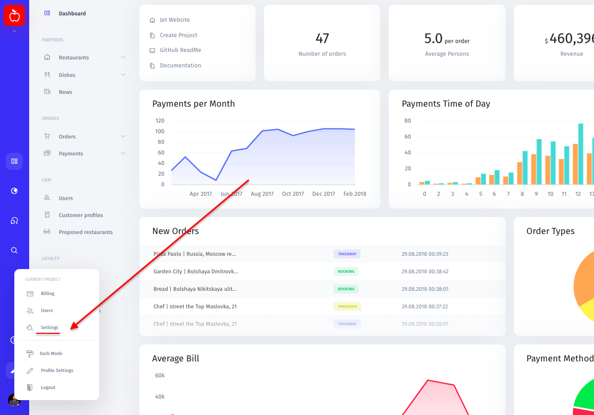
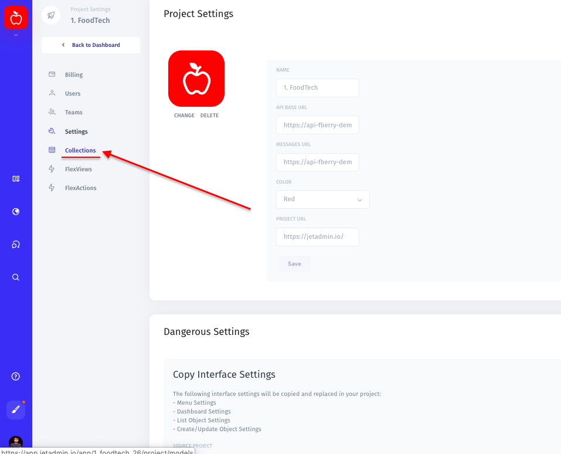
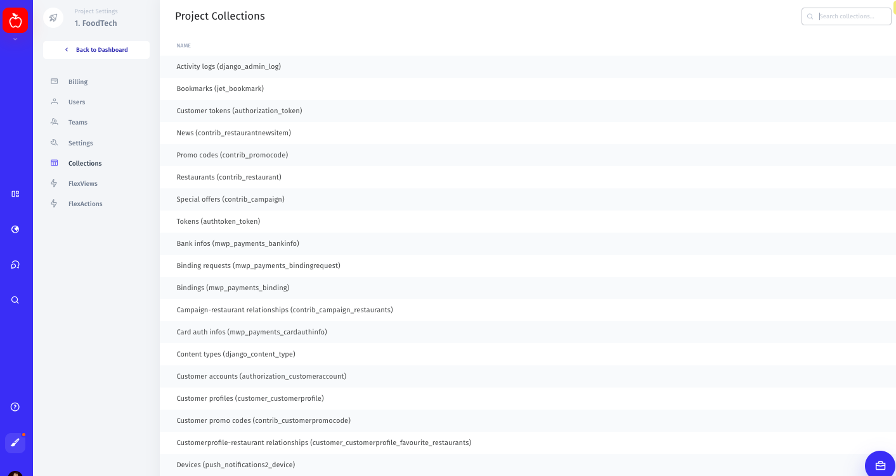
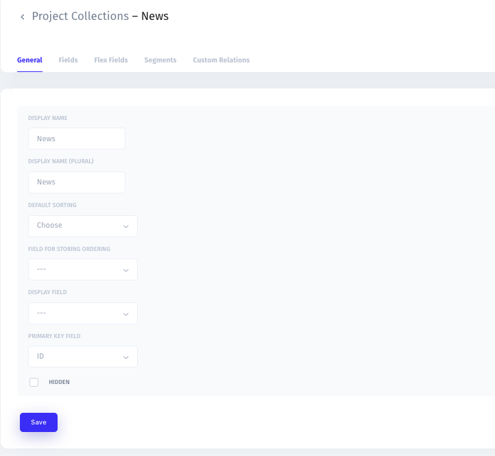

# Project Collections

To make changes to settings of **a particular collection**, go to Settings → Collections → {collection name}. 

In the Project Collections page, you can manage General settings for the collection you chose as well as its settings for **Fields**, **Flex fields**, **Segments**, and **Custom Relations**.

## General

In the General settings, you can change the name of a collection, set up default sorting, specify the field for storing ordering, choose a display field and primary key field. 

Also, you can hide a collection by simply checking the "hidden" box at the bottom of the page. 

## Fields

In the Fields settings, you can make changes to the "key" and "created" fields of a collection: change the display name, field type, default value, and number of rows. You can also make these fields required, editable, and filterable. 

Learn more about fields here:



## Flex Fields

Here you can manage your existing custom fields or create a new one. To create a new flex field, you would have to specify a unique name, display title, and insert code or a query.

Here's a step-by-step guide on how to create a Flex Field:



## Segments

Here you can add a new simple or SQL segment as well as delete your segments.

Learn more about segments here:



## Custom Relatioships

Click the "Add Segment" button in the menu on the left to create a new segment. Here you can type in the name of a new segment, make it visible/invisible, and add a filter or several filters for this segment.

To delete a segment, select a segment you want to remove in the menu on the left, then scroll down and hit the "Delete" button.

Learn more about segments here:

Here you can set up and change relationships between your collections. 

A **relationship** is a situation when one collection has a field that references a key field from a different collection. This allows for relational collections to split and store data by simply linking disparate pieces of data.

In the Custom Relationships page, you can create a new relationship by specifying a relational path between two or more collections. 

