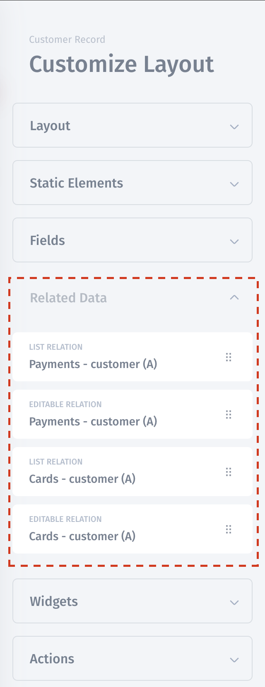
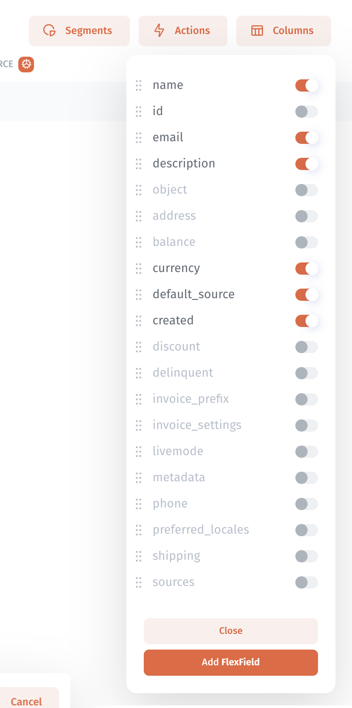
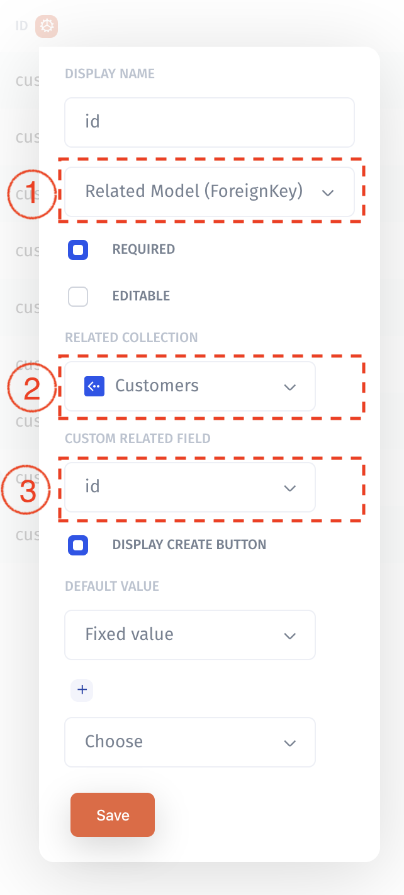

# Relations

Relations - ...

Jet automatically detected relations between collections in the same resource and your are able to use it on collection view or record view. Also, you are able to specify relations between collections in different resources.

## Define relations between collections

### One-to-one

The simplest kind of relationship is a one-to-one relationship. Using [linked record fields](field/related-record-fields.md), you could then set it up so that every record in the collection is linked with another collection.

1. Field widget – **Related Model \(OneToOneField\)**
2. **Related collection** – choose related collection
3. Specify **custom related field** which join two collections

\*\*\*\*

### One-to-many

A more complex \(but also far more common\) type of relationship is one-to-many/many-to-one

1. Field widget – **Related Model \(Foreign Key\)**
2. **Related collection** – choose related collection
3. Specify **custom related field** which join two collections

### 

