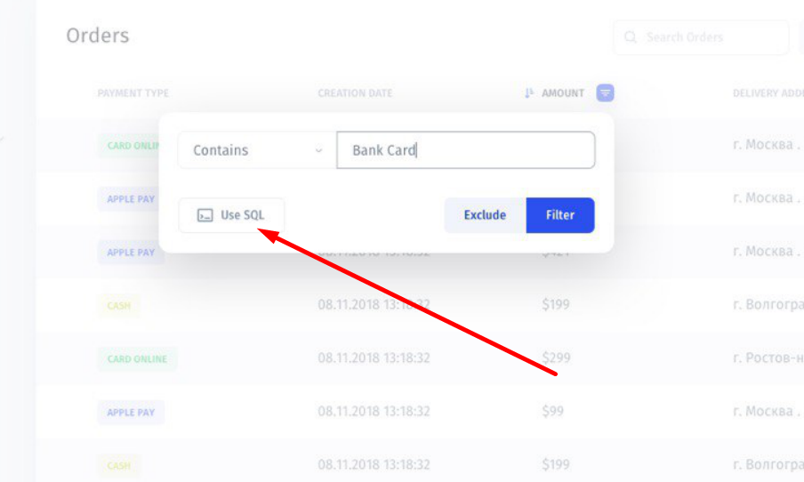

# Segments

## What is a segment?

A segment is a subgroup of your collection that only contains filtered records.

Use segments, when you need to quickly find and navigate through the same filtered data **on a regular basis.** A very common example is creating segments of statuses/types of orders, such as _Preorder_ and _Takeaway._ 

All segments will be displayed under the name of a collection to which they belong in the main menu.

## Creating a segment

### Method 1. From a collection view

To create a simple segment, apply a filter or a set of filters [by following these guidelines](https://app.gitbook.com/@jetadmin/s/doc/~/drafts/-Lk4M0St76lt7wROBK7J/primary/filter#adding-a-filter) and then click the disk icon next to the filter\(s\) tag. Then type in the name of a new segment and click "Add Segment".

### Method 2. From the settings

Click on your profile pic in the lower-left corner of the screen **\(1\)**. Go to Setting **\(2\)** ➝ Collections **\(3\)** ➝ {collection name} **\(4\)** ➝ Segments **\(5\)**

Click the "Add Segment" button in the menu on the left to create a new segment. Here you can type in the name of a new segment, make it visible/invisible, and add a filter or several filters for this segment.

## Creating a SQL Query segment

You can create a SQL Query segment in either of two ways:

### Method 1. From a collection view 

In a collection view, click the "Filter" button  at the top right or hover over a collection column and hit "Add filter", then click "Use SQL".

After the filter is applied, you can create a segment by clicking the disk icon next to its tag in the top bar.

### Method 2. From the settings

Go to Setting ➝ Collections ➝ {collection name} ➝ Segments, type in  the name of a new segment, make it visible/invisible, and run a SQL query to apply a filter to create this segment.

## Managing segments

You can rename **\(1\)**, drag and drop **\(3\)**, and make your segments visible/invisible **\(2\)** by entering the Visual Builder mode and clicking on the menu. 

## Deleting a segment

To delete a segment, go to Settings ➝ Collections, then choose a collection in which you would like to delete a segment ****and open the "Segments" tab. 

Select a segment you want to remove in the menu on the left, then scroll down and hit the "Delete" button.

