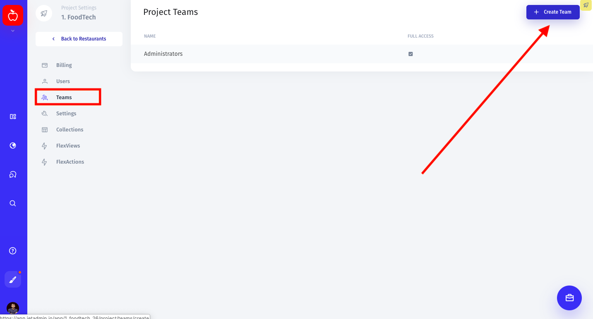
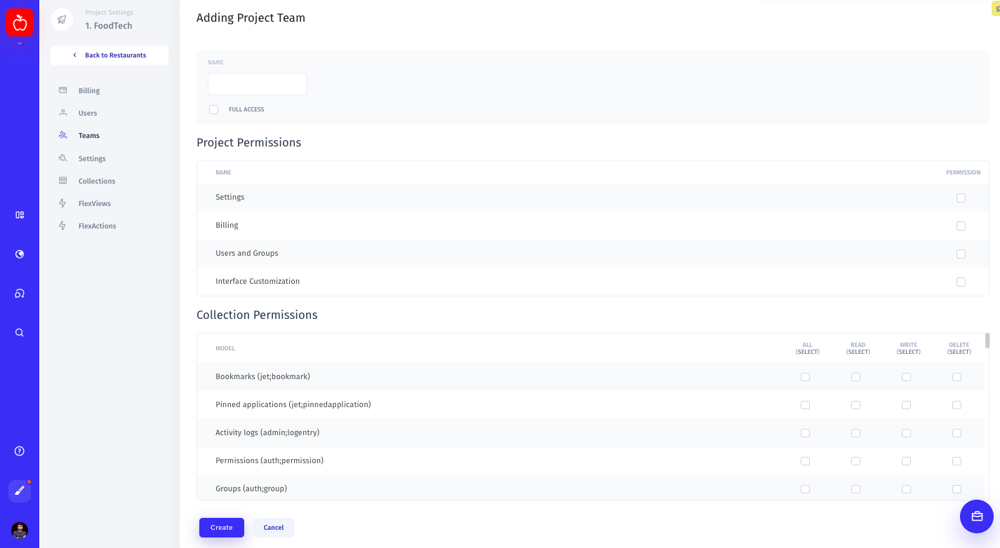
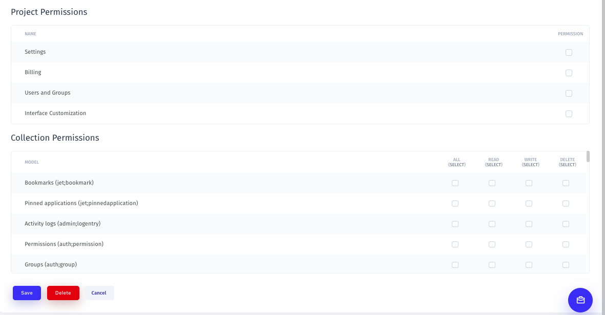

# Create and manage a team

## Create a new team

To create a new team, click on your profile pic in the lower-left corner of the screen, then go to Settings ⟶ Teams and click the "Create Team" button in the top right corner. 

You'll be taken to a new window, where you can type in the name of a new team and manage both project and collection permissions for this team. 

## Manage your teams' permissions

Once a new team is created, it will appear in the "Teams" tab. You can always come back here to change your teams' permissions, delete a team, or create a new one.

Select a team from the list and click on its name to start managing permissions. You can either give full access to all existing projects and collections or share access rights only to specific ones. 

### Project Permissions

| Name | Description |
| :--- | :--- |
| Settings | Permission to edit project settings: project name, visual appeal, API Base URL, Message URL  |
| Billing | Permission to view billing information and make payments |
| Users and Teams | Permission to invite new users to an admin panel and create and manage teams |
| Interface Customization | Permission to customize the admin panel interface |

### Collection Permissions

You can assign permissions to All/Read/Write/Delete for all of your collections. 

_Note that you can give read-only or write-only access to your collections to enforce security and prevent accidents._ 

