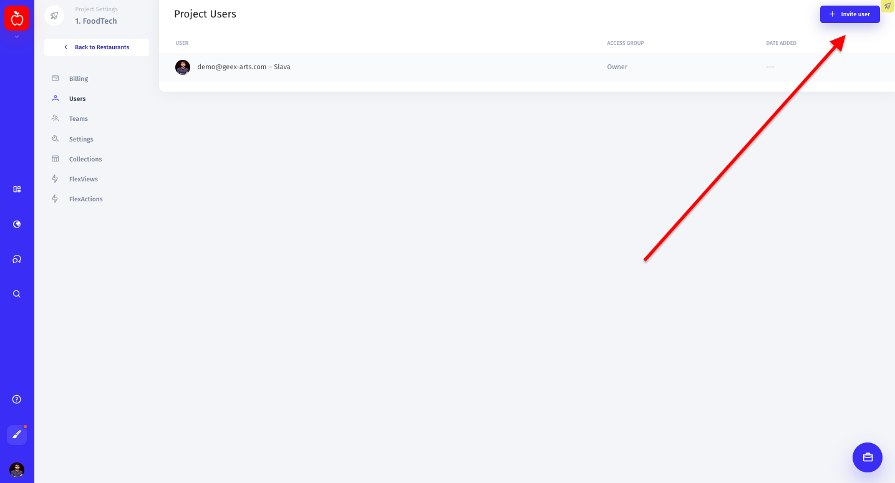
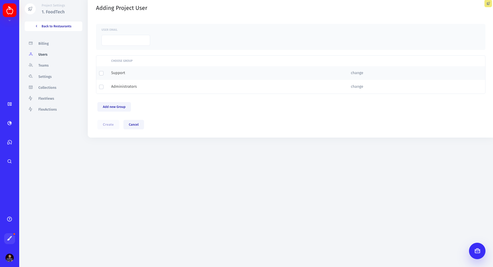

# Invite and manage users

To invite a user to your admin panel, click on your profile pic in the lower-left corner of the screen, then go to Settings ⟶ Users and click the "Invite user" button in the top right corner. 

Type in the email address of a person you would like to invite and choose a team \(or create a new one by clicking "Add new group"\) to which they will belong. 

After it's done, your teammate will receive an invite to your workspace and further instructions via email. 

