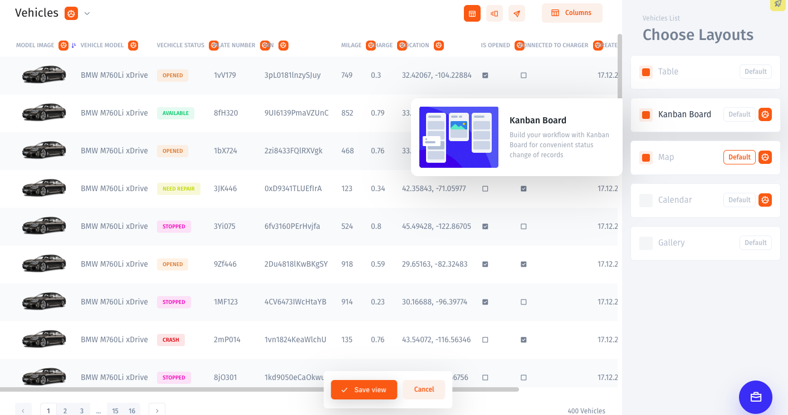
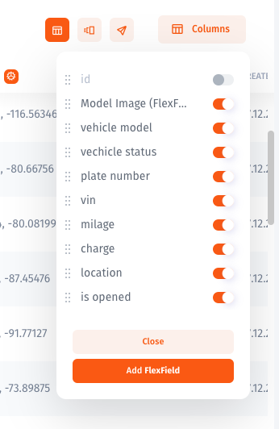

# Customize a collection

You can open the customization menu for all of your collections by clicking on the "Customize Interface" button in the lower-left corner of the screen. 

## Setting Up a Collection Widget

As soon as you choose a widget for your collection from the tab on the right, its tag will appear in the upper-right corner of your screen.

To make a widget visible on your admin panel, **check the box** to the left of the widget's name. To set up a **default widget**, click on the Deafult button to the right of the widget's name. 

_A default widget is the widget that will be displayed first when you or anyone on your team will open a specific collection._

Although you have to choose one default widget for your collection, you can still have multiple layouts for one collection and switch from one to another while you browse the data. 

Read more about Collection Widgets here:



## Managing Fields

Click on the "Columns/Card fields" tab in the upper-right corner of the screen to choose which columns you want to display on records in your collection. Also, you can change the order in which these columns are arranged by drag and dropping them on your list.   

Learn more about Field types and customization here:



## Creating a Flex Field

Say you want to merge first name and last name fields together or display a column from another Collection. ****You can create and display a computed value based on your current columns with Flex Fields. 

Here's a step-by-step guide on creating a Flex Field:



