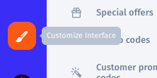
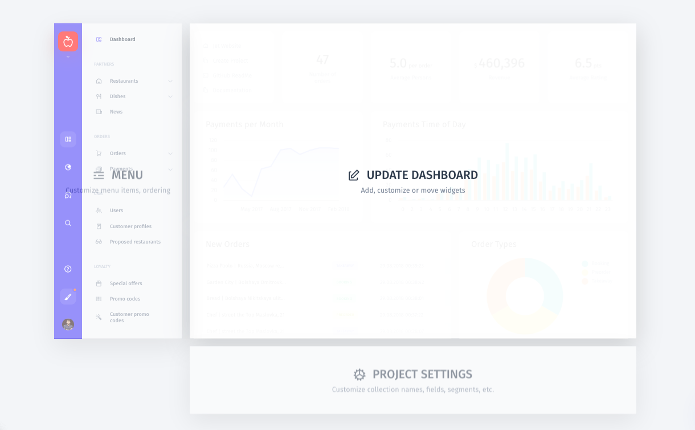
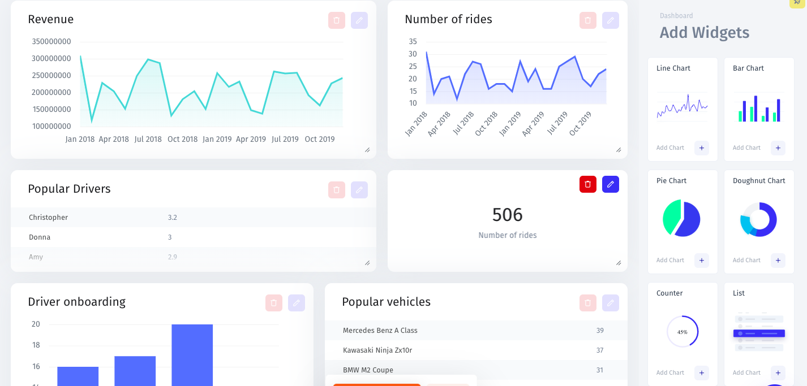
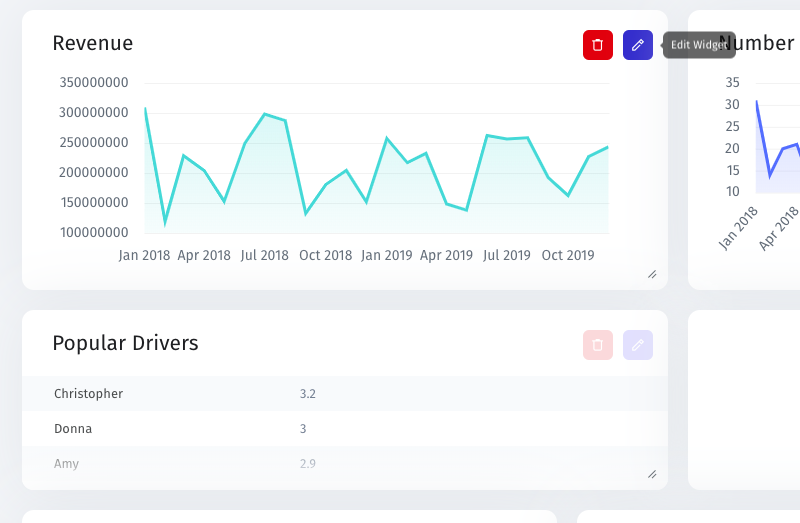
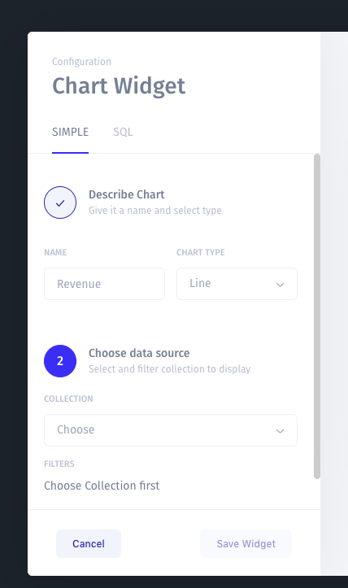

# Dashboard

Dashboards are where you can create analytical reports on your application data. Build charts by running basic or SQL queries.

### Customize a dashboard

You can add, customize or move widgets on any of your Dashboards by entering the Visual Builder mode. Click on the "Customize Interface" button in the lower-left corner of the screen, then click "Update Dashboard". 

Here you can visualize key metrics and KPIs by adding chart widgets to your dashboard. Simply select an appropriate widget from the menu bar on the right and drag and drop it on the dashboard.

To delete an existing widget, click on the red bucket icon. To edit, click on the pencil icon.  

In Edit mode, you can configure a chart by simply describing its data source, filters and display or by using an SQL Live Query.

Learn more about Chart Widgets here:



Learn more about SQL Charts here:



