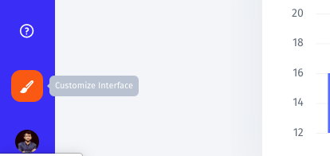
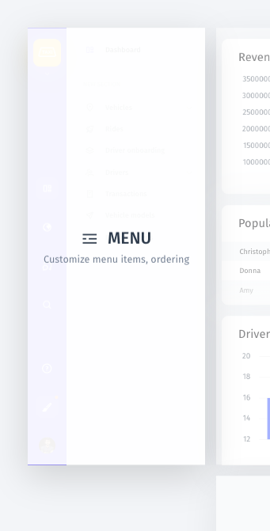
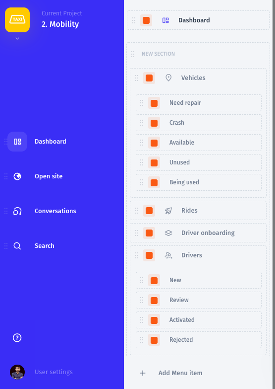
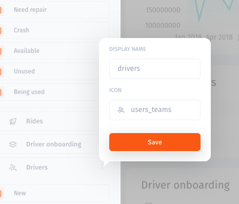
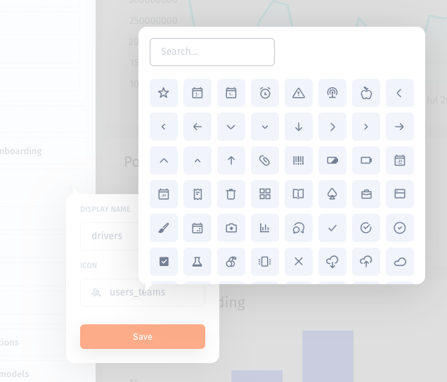

# Customize the Menu

### Customizing the Menu

To start editing the menu, enter the Visual Builder mode by clicking on the "Customize Interface" button in the lower-left corner of the screen **\(1\)** and choosing "Customize menu items..." **\(2\)**.

In the opened tab, you can drag and drop menu items, add new items, and create sections.

You can edit the name of a specific item by simply hovering over it. Also, you can click on the cog icon next to a specific menu item to change its name and choose an appropriate icon.

