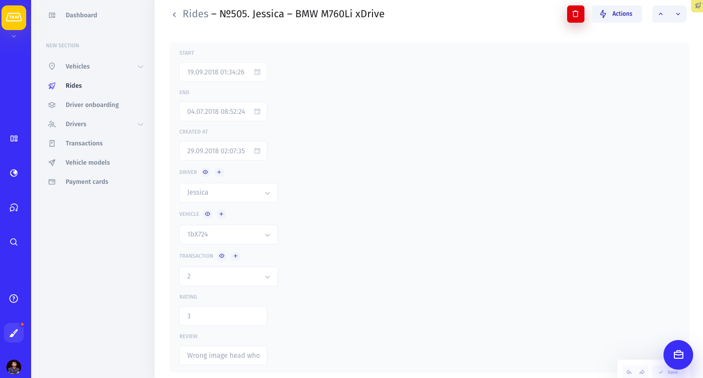

# Record View

### What is a Record View?

A Record view is where you can view and manage the information on a specific record as well as perform actions on it.

All of the fields on your record are editable, so you can input and change important data quickly.

To navigate between records of the same collection, use the arrows in the top right corner of the record view.

Perform an action on a record by clicking on the Actions button in the top right corner of the screen and selecting an action. 

You can delete a record by clicking on the red bucket icon to the left of the Actions button.

