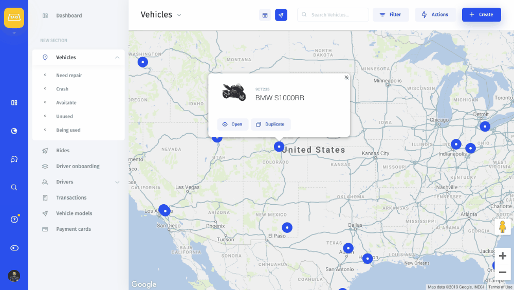
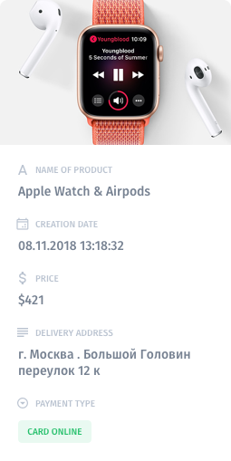
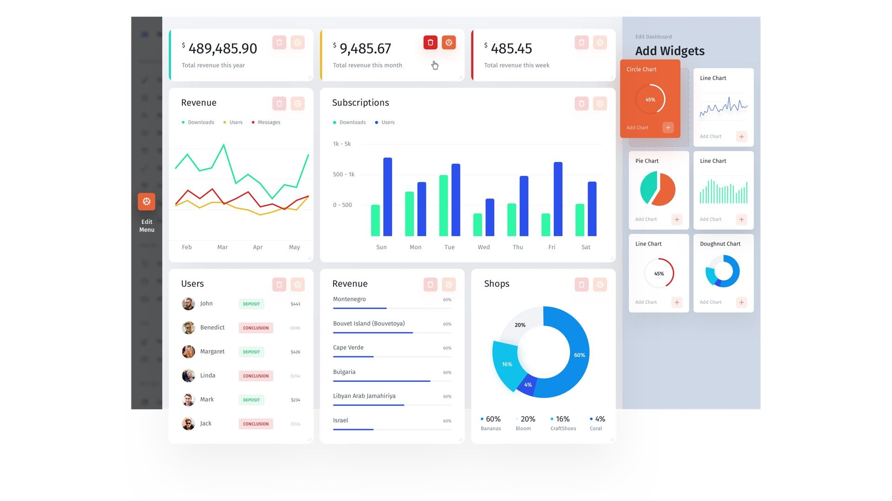

# Visual Builder

## What is the Visual Builder?

The Visual Builder is an all-in-one editing feature that helps you edit, customize, and drag and drop interface elements in Jet ****Admin.

To start editing enter the customization mode by clicking on the "Customize Interface" button in the lower-left corner of your admin panel.

## **Views**

Jet Admin consists of the following **Views** that can be modified with the **Visual Builder**:

* **Dashboard**. Dashboards are where you can create analytical reports on your application data. Build charts by running basic or SQL queries.

Learn more about Dashboards:



* **Record View**. Manage all the data about a specific user, product, etc. in a Record View.

Learn more about the Record view:



* **Collection View**. Keep related Records nicely organized in different Collections.

Learn more about the Collection view:



* **Menu**. You can quickly search through all of your Collections and features in the Menu.

Learn more about the Menu:



All of the Views are fully customizable. You can even build your own **Record View**, if you’d like: add or remove columns, tabs, and sections, choose appropriate fields and related collections, and set up [**Actions**](https://docs.jetadmin.io/customization/flexaction) to be performed on a specific record or collection.

## **Widget Library**

The Visual Builder has a large library of **widgets** that includes:

### **Collection Widgets**

You can display your data in a familiar **Table** view or change the widget type in the settings. Effortlessly track your delivery team in the **Map** widget, write down the upcoming appointments in a **Calendar**, process orders in a **Kanban** board, or keep the pictures of your products in a **Gallery**.

Learn more about the Collection widgets:



### **Field Widgets**

**Fields** are single pieces of data about a specific **Record**. There are several types of **Field Types**: **Text**, **Checkbox**, and **Single**/**Multiple Select**. If you need to create a record of a product for sale, you can even insert an **Image** in one of the fields to differentiate this specific product from other records.

Learn more about the Field widgets:



### **Chart Widgets**

These are great for displaying your KPI performance indicators like total revenue, the number of orders, etc. Depending on how you’d like to visualize your data, you can choose from **Line**, **Bar**, **Pie**, and **Doughnut** charts.

Learn more about the Chart widgets:



## **Extensibility**

You can **extend** Jet’s interface at any time. [Code your own widget into your Jet admin panel using JS, HTML, or CSS](views/flex-view.md) ****with our Flex View feature. 

Here's the instruction on how to create a Flex View:

